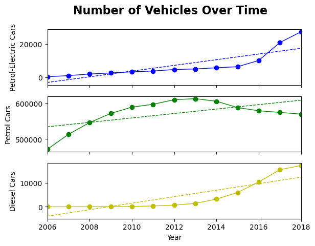

# Forecasting Vehicle Trend Analysis

This Jupyter Notebook analyzes vehicle registration trends over time, focusing on different engine types — specifically Petrol-Electric, Petrol, and Diesel cars. Using data visualization and linear regression, the notebook uncovers growth patterns and forecasts for each category.

## Features

- Filters vehicle data by engine type and car classification
- Visualizes trends with matplotlib scatter and line plots
- Applies linear regression using scipy.stats.linregress
- Predicts future values (e.g., vehicle counts in 2024)
- Annotates plots with fit lines and interprets statistical outputs
- Displays a combined graph with three subplots for easy comparison across engine types

## Technologies Used

- Python 3
- Pandas
- NumPy
- Matplotlib
- SciPy

## File Structure

- `vehicles.ipynb`: Main notebook containing data filtering, visualization, and regression analysis

## Visualization Results

- Time-series scatter plots for:
  - Petrol-Electric cars
  - Petrol cars
  - Diesel cars
- Regression trend lines with slope, intercept, and correlation stats
- Displays a combined graph with three subplots for easy comparison across engine types

### Combined Graph Preview

